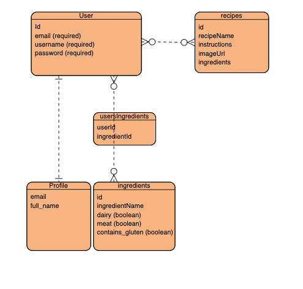
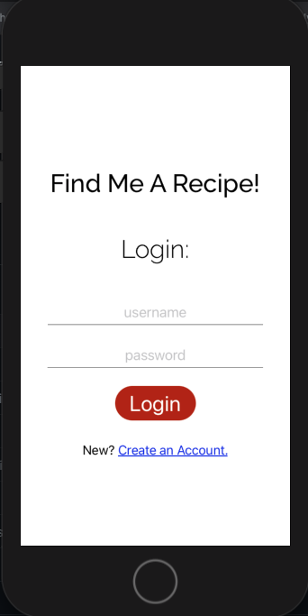
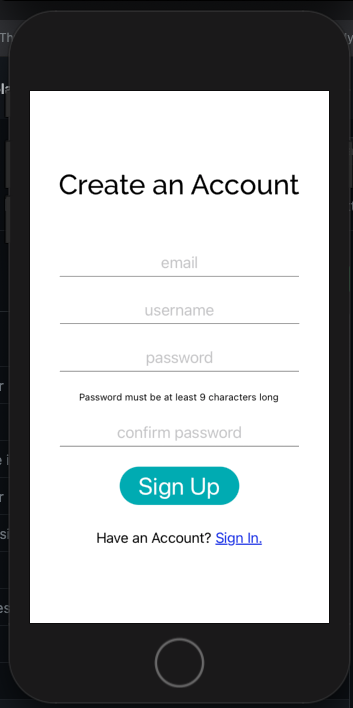
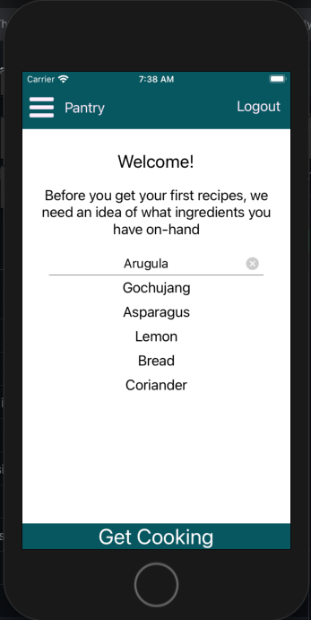
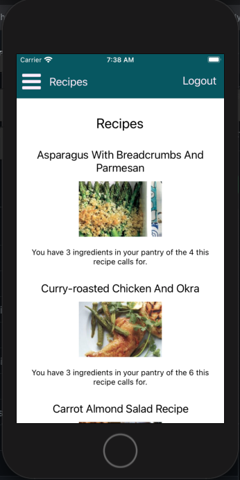
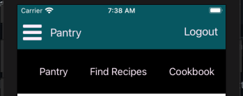
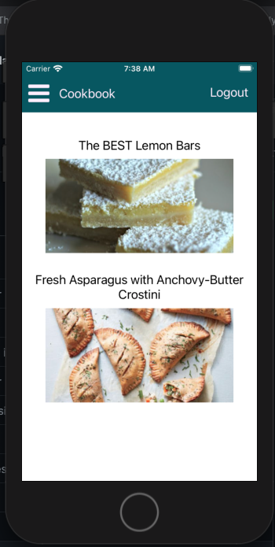
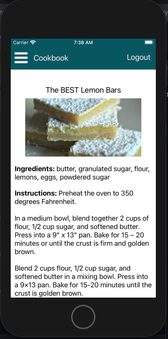

# Final Project: Fullstack Recipe App

### Deployed URL:
https://limitless-atoll-35923.herokuapp.com/

## Find Me a Recipe

Find Me A Recipe is committed to eliminating food waste and encouraging explorative cooking choices. The app accomplishes this by suggesting recipes to users based on on-hand ingredients in the pantry or refrigerator. This is an app for getting recipe ideas when you don't want to (or cannot) take a trip to the grocery store and you need inspiration for what you can cook with what you have.
 
Find Me a Recipe is built with Node, Express, React Native, and PostgreSQL. The database uses three models: user, ingredient, and recipe. The user and ingredient model has a many-to-many relationship while the user and recipe has a one-to-many to ensure that users can add, edit, and delete the same recipes.

### Local Installation Instructions:
- this assumes you have postgres, node, and expo installed. 

Git clone the backend and install the dependencies:
```bash
git clone https://github.com/samleemcknight/final_project_api.git
cd final_project_api
npm i
```
Create a local databse
```bash
createdb recipe_api
sequelize db:migrate
```
Git clone the client-side and install expo:
```bash
git clone https://github.com/samleemcknight/final_project_client.git
cd final_project_client
npm i
```

You will have to create your own ``.env`` file and create your own SECRET_SESSION variable in the API and supply your local machine's IP address to an in place of the url on the client side (of course, you can just use the Heroku server to make things easier). After this, run nodeman (``nodemon``) and expo (``npm start``) on two terminal windows.

### ERD:



## User Stories:

As a user...

- I want to sign up and log in to the app
- upon logging in for the first time, I want to be prompted to input the ingredients I have on-hand
- I want to be able to update my ingredients whenever needed
- I want to be able to save recipes to, and remove them from, my favorites
- I want an easy-to-use, minimalist UI

## Screenshots:

Log-In/Sign Up Screen:




Welcome Screen:



Suggestions Home Screen:



Navbar:



Cookbook Index:



Cookbook Show Page:


